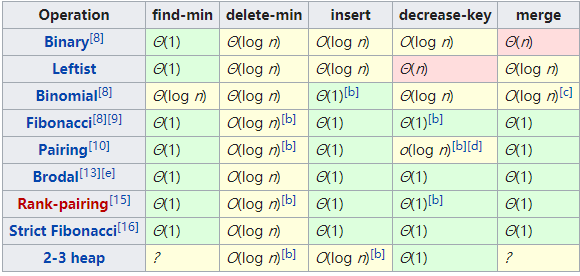

<!-- more -->

# Stack

## [Leecode P20](https://leetcode.com/problems/valid-parentheses/):字符串是否有效检查(栈)

### 描述
    Given a string containing just the characters '(', ')', '{', '}', '[' and ']', determine if the input string is valid.

    An input string is valid if:
        1. Open brackets must be closed by the same type of brackets.
        2. Open brackets must be closed in the correct order.
    Note that an empty string is also considered valid.

### 解题思路

使用堆栈进行解答

    for 遍历字符串 {
        1. 是左括号入栈
        2. 不是左括号：
           1. 栈顶是所匹配的左括号，pop（）栈顶元素出栈
           2. 不是所匹配的左括号，或者栈为空 return false
    }

    return 栈是否为空

### 代码

```go
func isValid(s string) bool {
	stack := make([]byte, 0)
	hash := map[byte]byte{')': '(', ']': '[', '}': '{'}
	for _, v := range s {
		t, ok := hash[byte(v)]
		if !ok {
			stack = append(stack, byte(v))
		} else if l := len(stack); l != 0 && t == stack[l-1] {
			stack = stack[:l-1]
		} else {
			return false
		}
	}
	return len(stack) == 0
}

// 测试用例：
tb := assert.TestTable{
		"":        true,
		"()":      true,
		"([{}])":  true,
		"((({}))": false,
		"[([)]]":  false,
		"(([])))": false,
	}
```

### Feedback

- 字符替换

	```js
	let isValid = function(s) {
		if (s.length & 1) return false
		let old
		do {
			old = s
			s = s.replace(/(\[\]|\(\)|\{\})/g, '')
		} while (old.length !== s.length)
		return s.length === 0
	}
	```
	**点评：** 代码简洁，但是replace 时间复杂度过高。

# Queue

## [Leecode P232](https://leetcode.com/problems/valid-parentheses/): 用栈实现队列

### 描述

    使用栈实现队列的下列操作：

    push(x) -- 将一个元素放入队列的尾部。
    pop() -- 从队列首部移除元素。
    peek() -- 返回队列首部的元素。
    empty() -- 返回队列是否为空。
    示例:

    MyQueue queue = new MyQueue();

    queue.push(1);
    queue.push(2);  
    queue.peek();  // 返回 1
    queue.pop();   // 返回 1
    queue.empty(); // 返回 false
    说明:

    你只能使用标准的栈操作 -- 也就是只有 push to top, peek/pop from top, size, 和 is empty 操作是合法的。
    你所使用的语言也许不支持栈。你可以使用 list 或者 deque（双端队列）来模拟一个栈，只要是标准的栈操作即可。
    假设所有操作都是有效的 （例如，一个空的队列不会调用 pop 或者 peek 操作）。

### 思路

使用两个栈，分别为input和output,push使用input,pop和pick使用output.
pop和pick时如果output栈为空，则将input栈的内容逐一pop进output栈。

### 代码

```go
type MyQueue struct {
	stack_input []interface{}
	stack_ouput []interface{}
}

/** Initialize your data structure here. */
func Constructor() MyQueue {
	return MyQueue{
		make([]interface{}, 0),
		make([]interface{}, 0),
	}
}

/** Push element x to the back of queue. */
func (this *MyQueue) Push(x int) {
	this.stack_input = append(this.stack_input, x)
}

/** Removes the element from in front of queue and returns that element. */
func (this *MyQueue) Pop() int {
	if len(this.stack_ouput) == 0 {
		for i:= len(this.stack_input)-1; i>=0; i-- {
			this.stack_ouput = append(this.stack_ouput, this.stack_input[i])
		}
		this.stack_input = this.stack_input[0:0]
	}

	l := len(this.stack_ouput)
	t := this.stack_ouput[l-1]
	this.stack_ouput = this.stack_ouput[:l-1]
	return t.(int)
}

/** Get the front element. */
func (this *MyQueue) Peek() int {
	if len(this.stack_ouput) == 0 {
		for i:= len(this.stack_input)-1; i>=0; i-- {
			this.stack_ouput = append(this.stack_ouput, this.stack_input[i])
		}
		this.stack_input = this.stack_input[0:0]
	}
	t := this.stack_ouput[len(this.stack_ouput)-1]
	return t.(int)
}

/** Returns whether the queue is empty. */
func (this *MyQueue) Empty() bool {
	return len(this.stack_input) == 0 && len(this.stack_ouput) == 0
}

/**
 * Your MyQueue object will be instantiated and called as such:
 * obj := Constructor();
 * obj.Push(x);
 * param_2 := obj.Pop();
 * param_3 := obj.Peek();
 * param_4 := obj.Empty();
 */
```

### Feedback

# Priority Queue (Min Heap)

## [Leecode P703 P215](https://leetcode.com/problems/valid-parentheses/): 数据流中的第K大元素

### 描述

	设计一个找到数据流中第K大元素的类（class）。注意是排序后的第K大元素，不是第K个不同的元素。

	你的 KthLargest 类需要一个同时接收整数 k 和整数数组nums 的构造器，它包含数据流中的初始元素。每次调用 KthLargest.add，返回当前数据流中第K大的元素。

	示例:

	int k = 3;
	int[] arr = [4,5,8,2];
	KthLargest kthLargest = new KthLargest(3, arr);
	kthLargest.add(3);   // returns 4
	kthLargest.add(5);   // returns 5
	kthLargest.add(10);  // returns 5
	kthLargest.add(9);   // returns 8
	kthLargest.add(4);   // returns 8
	说明: 
	你可以假设 nums 的长度≥ k-1 且k ≥ 1。

### 思路

1. 维护一个k大小的素组，添加时直接排序
2. 利用优先队列（小顶堆）实现

### 代码

```go
type KthLargest struct {
	nums []int
	k    int
}

func (kl *KthLargest) Len() int {return len(kl.nums)}
func (kl *KthLargest) Less(i, j int) bool {return kl.nums[i] < kl.nums[j]}
func (kl *KthLargest) Swap(i, j int) {kl.nums[i], kl.nums[j] = kl.nums[j], kl.nums[i]}

func (kl *KthLargest) Push(x interface{}) {
	kl.nums = append(kl.nums, x.(int))
}

func (kl *KthLargest) Pop() interface{} {
	i := len(kl.nums) - 1
	r := kl.nums[i]
	kl.nums = kl.nums[0:i]
	return r
}

func Constructor(k int, nums []int) KthLargest {
	kl := KthLargest{
		nums: make([]int, 0, k),
		k:    k,
	}
	for _, v := range nums {
		if kl.Len() < k {
			heap.Push(&kl, v)
		} else {
			if v > kl.nums[0] {
				heap.Push(&kl, v)
				heap.Remove(&kl, 0)
			}
		}
	}
	return kl
}

func (kl *KthLargest) Add(val int) int {
	if kl.Len() < kl.k {
		heap.Push(kl, val)
	} else {
		if val > kl.nums[0] {
			heap.Push(kl, val)
			heap.Remove(kl, 0)
		}
	}
	return kl.nums[0]
}

/**
 * Your KthLargest object will be instantiated and called as such:
 * obj := Constructor(k, nums);
 * param_1 := obj.Add(val);
 */
```

### Feedback

# Deque 双边队列

##  [Leecode P293](https://leetcode.com/problems/sliding-window-maximum/): 滑动窗口最大值

### 描述

	给定一个数组 nums，有一个大小为 k 的滑动窗口从数组的最左侧移动到数组的最右侧。你只可以看到在滑动窗口 k 内的数字。滑动窗口每次只向右移动一位。

	返回滑动窗口最大值。

	示例:

	输入: nums = [1,3,-1,-3,5,3,6,7], 和 k = 3
	输出: [3,3,5,5,6,7] 
	解释: 

	滑动窗口的位置                最大值
	---------------               -----
	[1  3  -1] -3  5  3  6  7       3
	1 [3  -1  -3] 5  3  6  7       3
	1  3 [-1  -3  5] 3  6  7       5
	1  3  -1 [-3  5  3] 6  7       5
	1  3  -1  -3 [5  3  6] 7       6
	1  3  -1  -3  5 [3  6  7]      7
	注意：

	你可以假设 k 总是有效的，1 ≤ k ≤ 输入数组的大小，且输入数组不为空。

### 思路
	1. 使用优先队列(大顶堆实现)
	2. 使用deque双边队列实现
### 代码

#### deque $O(N)$

```go
//使用deque
func maxSlidingWindow(nums []int, k int) []int {
    if nums == nil {
        return nil
    }
    var res, window []int
    for i,val:= range nums {
        //移除超出左边界的元素
        if i-k >= 0 && window[0] <= i-k {
            window = window[1:]
        }
        //移除右侧小于等于val的元素,这样保持最左侧为最大元素
        for  len(window) > 0 && nums[window[len(window)-1]] <= val {
             window = window[:len(window)-1]
        }
        
        window = append(window,i) //入窗
        if i >= k-1{
            res = append(res, nums[window[0]])
        }
    }
    return res
}
```

#### Priority Queue (Max Heap) $O(N\log(k))$

``` go
type SlidingWindow struct {
	nums []Item
}

type Item struct {
	p int
	i int
}

func (kl *SlidingWindow) Len() int {
	return len(kl.nums)
}

func (kl *SlidingWindow) Less(i, j int) bool {
	return kl.nums[i].p > kl.nums[j].p
}

func (kl *SlidingWindow) Swap(i, j int) {
	kl.nums[i], kl.nums[j] = kl.nums[j], kl.nums[i]
}

func (kl *SlidingWindow) Push(x interface{}) {
	kl.nums = append(kl.nums, x.(Item))
}

func (kl *SlidingWindow) Pop() interface{} {
	i := len(kl.nums) - 1
	r := kl.nums[i]
	kl.nums = kl.nums[0:i]
	return r
}

func maxSlidingWindow(nums []int, k int) []int {
	window := &SlidingWindow{
		nums: make([]Item,0),
	}
	r := make([]int, 0, k)
	for idx, value := range nums {
		for window.Len() > 0 && window.nums[0].i <= idx-k {
			heap.Remove(window, 0)
		}
		heap.Push(window, Item{p: value, i: idx})
		if idx >= k-1 {
			r = append(r, window.nums[0].p)
		}
	}
	return r
}
```

### feedback

