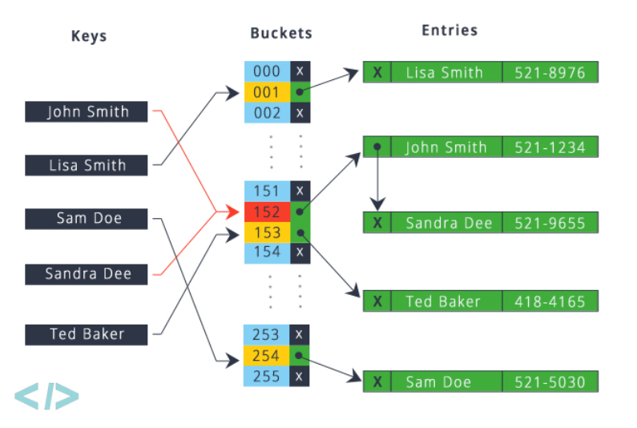

<!-- more -->

# Hash

## [Leecode P1](https://leetcode.com/problems/two-sum/comments/): 两数之和

### 描述

    给定一个整数数组 nums 和一个目标值 target，请你在该数组中找出和为目标值的那 两个 整数，并返回他们的数组下标。

    你可以假设每种输入只会对应一个答案。但是，你不能重复利用这个数组中同样的元素。

    示例:

        给定 nums = [2, 7, 11, 15], target = 9

        因为 nums[0] + nums[1] = 2 + 7 = 9
        所以返回 [0, 1]

### 思路

1. 暴力求解，双重循环。 时间复杂度 $O(N^2)$
2. 排序，首位双指针遍历，但是會打亂原始數據。时间复杂度 $O(N)$
3. hash。通过在hash中查找target-x的方法。 时间复杂度 $O(N)$

### 代码

- Time: $O(N)$
- Space: $O(N)$

```go
func twoSum(nums []int, target int) []int {
	m := make(map[int]int)
	for i, v := range nums {
		if r, ok := m[target-v]; ok && r != i {
			return []int{r, i}
		}
		m[v] = i
	}
	return []int{}
}
```

### Feedback

- HASH 在一般題目中用于快速查詢。

## [Leecode P15](https://leetcode.com/problems/3sum/): 三数之和 

### 描述
    给定一个包含 n 个整数的数组 nums，判断 nums 中是否存在三个元素 a，b，c ，使得 a + b + c = 0 ？找出所有满足条件且不重复的三元组。

    注意：答案中不可以包含重复的三元组。

    例如, 给定数组 nums = [-1, 0, 1, 2, -1, -4]，

        满足要求的三元组集合为：
        [
        [-1, 0, 1],
        [-1, -1, 2]
        ]
### 思路

1. 暴力解題 $O(N^3)$
2. 讲3素和转化为2数和 $z = 0 - (x+y)$ 时间复杂度 $O(N^2)$

TIP： "答案中不可以包含重复的三元组"  因此排序后采用首尾指针

### 代碼

```go
func threeSum(nums []int) [][]int {
    var res [][]int
    sort.Ints(nums)
    for i, v := range nums {
        if i > 0 && nums[i-1] == v {
            continue
        }
        if v > 0 {
            break
        }
        v = -v
        for low, hi := i+1, len(nums)-1; low < hi; {
            if low > i+1 && nums[low] == nums[low-1] {
                low++
                continue
            }
            if nums[low]+nums[hi] < v {
                low++
            } else if nums[low]+nums[hi] > v {
                hi--
            } else {
                res = append(res, []int{-v, nums[low], nums[hi]})
                low, hi = low+1, hi-1
            }
        }
    }
    return res
}
```


### Feedback
